🚧 日本語版の`README`に関しては、プロジェクトが完成次第、追加させていただきます。

# Pocket Pod

> Turn any article into a clean, downloadable podcast episode – built as a learning exercise around AWS ECS, Redis Streams, and npm workspaces.

## Goal of the Project

This portfolio project exists first and foremost as a **learning playground**.  The focus areas are:

*  **AWS ECS Fargate** – container-native deployments without managing servers
*  **Redis Streams** – lightweight, high-throughput job queuing
*  **npm workspaces** – monorepo-friendly dependency management across services

## User Flow

```mermaid
flowchart TD
    A(["User signs in with GitHub"]) --> B["User submits article URL"]
    B --> C["Scrape article content"]
    C --> D["Generate 1–2 minute podcast"]
    D --> E{"Podcast ready"}
    E --> F["Listen to podcast (in-app)"]
    E --> G["Download podcast file"]
```

## Demo (2023/07/21)
https://github.com/user-attachments/assets/c84ac239-a585-448c-b2ed-7daafc9c536f

## Architectural Overview

The diagram shows the complete end-to-end flow from an authenticated request, to job queuing, worker processing with AWS Polly, and final asset storage in S3.

## Project Progress

### Backend

**Done** ✅

- [x] ECS cluster and supporting infrastructure defined with **AWS CDK**
- [x] Containerised **API** & **Worker** services
- [x] **Redis Streams** implementation for job dispatching
- [x] Job management APIs with persistence in **DynamoDB**
- [x] Workers push status updates to **DynamoDB**
- [x] Workers scrape articles, generate audio with **AWS Polly**, and upload to **S3**

**To Do** 🔜

- [ ] GitHub OAuth token verification infrastructure
- [ ] Auto-scaling based on custom **CloudWatch** metrics

### Frontend

- [ ] Authentication via **Auth.js** with GitHub provider
- [x] CRUD UI for managing podcasts
- [ ] Direct streaming & listening experience for generated episodes

---

*This README will evolve alongside the project*
